Binding two processes on the same port for fun and firewall evasion
====

Intro
----

A while ago I was investigating a strange error in one of our test environments: we had our own syslog server set up, and we were sending messages to it using ncat. The client side seemed to work, but no messages appeared on the server. It turned out that an rsyslog instance was also running on the test machine, and it was receiving our messages instead of our syslog server. But how? - you might ask; how could we listen on port TCP/514 when rsyslog was already listening on it? I admit, this baffled me first, since I didn't know about the mess that SO_REUSEADDR and SO_REUSEPORT is. Mess I say, because they behave quite differently on different platforms.

Anyways, when I found out that this is the issue, the first thing popped into my mind was that maybe this could be abused to help create bind shells in heavily firewalled environments. As it turned out, binding two applications to the same port even has its own CWE number: [CWE-605: Multiple Binds to the Same Port](https://cwe.mitre.org/data/definitions/605.html). This further increased my shame about not being familiar with this stuff :)

In the hope that I can help some lost souls like I was, I wrote this post about how these socket options work on FreeBSD, Linux and Windows, and I will show - the pretty obvoius way - how servers that use these options can be abused to help backdooring a machine. Please keep in mind though that this is not an in-depth introduction to sockets, I'll just cover the parts that are important for understanding the firewall evasion examples I'll show later.

BSDs
----

Because most socket implementations that are used today derived from the Berkeley sockects, I'll start with BSDs, FreeBSD in particular. So, what is this SO_REUSEADDR thingy? An excerpt from `man getsockopt` on HardenedBSD 11.0-CURRENT:

> **SO_REUSEADDR**       enables local address reuse
> **SO_REUSEPORT**       enables duplicate address and port bindings
>
> ...
> 
> **SO_REUSEADDR** indicates that the rules used in validating addresses
> supplied in a bind(2) system call should allow reuse of local addresses.

Well, the explanation of SO_REUSEADDR is a little vague in my opinion, I'll try to explain it better. It is well known that *by default* one can not bind two sockets with the same source address and source port. But if there was no way around this, it could cause problems when one tries to e.g. restart a service and there are still lingering connections (sockets in TIME_WAIT state) - since one cannot bind two sockets with the same source address and port, starting the service will fail. This is why services that listen on sockets tend to use SO_REUSEADDR, which tells the socket stack to simply ignore sockets that are in TIME_WAIT state.

It has another - more important, from an attacker's perspective - effect: it allows one to bind two sockets to the same port if one of the addresses is a wildcard address. For example, one can bind 192.168.1.1:80 even if 0.0.0.0:80 is already bound. And this option doesn't have to be set on both sockets: even if the application listening on 0.0.0.0:80 does not use it, another app still can, and successfully bind on 192.168.1.1:80. One caveat though: one has to have appropriate permissions: either the same user that listens on the wildcard address, or root.

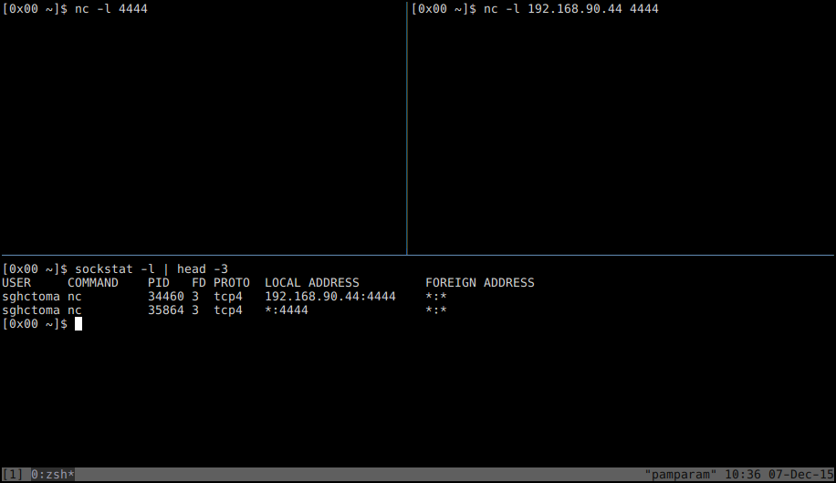

Ok, hopefully SO_REUSEADDR is clear now, and luckily the man for SO_REUSEPORT does a much better job explaining what it really does. 

> **SO_REUSEPORT** allows completely duplicate bindings by multiple processes
> if they all set SO_REUSEPORT before binding the port.  This option
> permits multiple instances of a program to each receive UDP/IP multicast
> or broadcast datagrams destined for the bound port.

It allows one to bind multiple sockets to **exactly** the same source address and port as long as all the sockets involved use this option. For example, netcat binds with this option set, so one can do this:

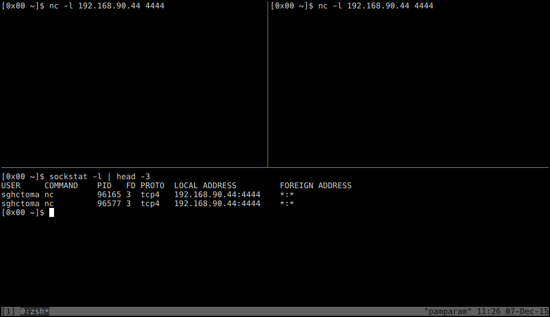

This is about all the information we need, we can now proceed to another platform.

Linux
-----

On Linux, SO_REUSEADDR behaves differently: 

> **SO_REUSEADDR**
> 	Indicates that the rules used in validating addresses supplied in a bind(2) call should allow reuse of
>	local addresses. For AF_INET sockets this means that a socket may bind, except when there is an
>	active listening socket bound to the address. When the listening socket is bound to INADDR_ANY with a
>	specific port then it is not possible to bind to this port for any local address.  Argument is an
>	integer boolean flag.

There is a huge restriction here: in contrast to FreeBSD, on Linux one is not allowed to bind a socket to a port if another socket is already listening on the same port on a wildcard address even if we are root:

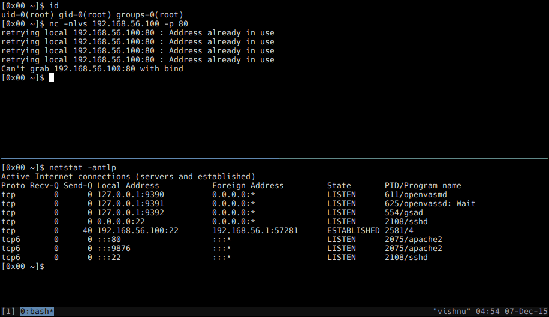

This restriction would render the method described in this post completely unfeasible, but there is something missing from the man: the restriction does not apply to UDP sockets! So one can still do this:

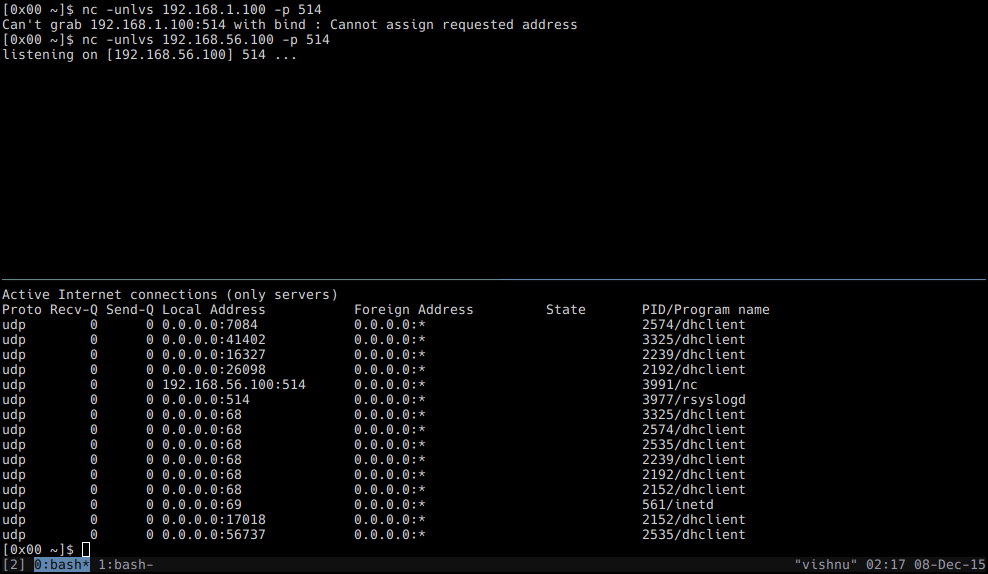

Well, what about SO_REUSEPORT? Until version 3.9, Linux did not have a SO_REUSEPORT options, so there was no way to bind a socket to the same source address and port. Since 3.9 the option is present on Linux also, and behaves the same as on FreeBSD.

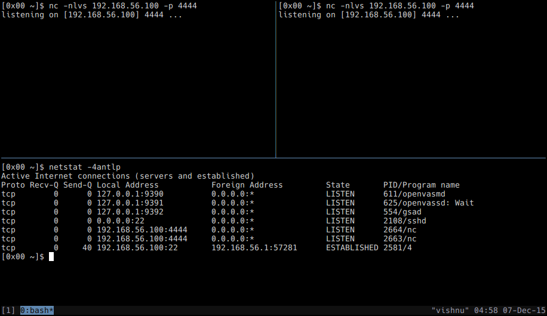

Windows
----

Windows has the SO_REUSEADDR option, and it behaves almost the same as using both SO_REUSEADDR and SO_REUSEPORT on BSD. The only - although quite important - difference is that the socket stack doesn't really care about users, so for example a normal user can bind on a port on a specific address even if another process owned by NT Authority\SYSTEM is listening on the same port on 0.0.0.0. The following pictures shows that we could bind to port TCP/81 on a specific address as a normal user even though an nginx instance owned by NT AUTHORITY\SYSTEM was already listening on that port:

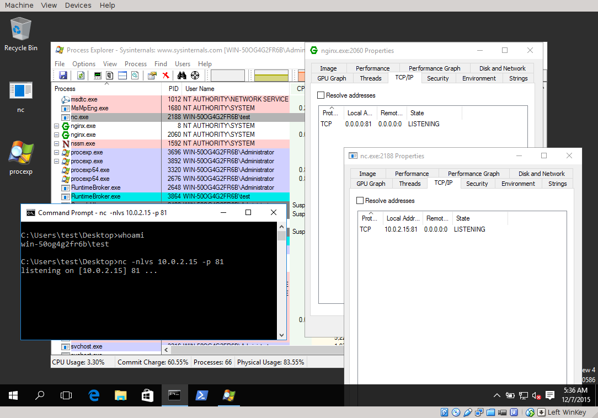

To mitigate the obvious security-related consequences, Microsoft introduced the SO_EXCLUSIVEADDRUSE option in Windows NT 4.0 SP4 (note however, that on XP and earlier, it could only be used by Administrators!). An excerpt from [MSDN](https://msdn.microsoft.com/en-us/library/windows/desktop/cc150667(v=vs.85).aspx):

> The SO_EXCLUSIVEADDRUSE option prevents other sockets from being forcibly
> bound to the same address and port, a practice enabled by the SO_REUSEADDR
> socket option. Such reuse can be executed by malicious applications to disrupt
> the application. The SO_EXCLUSIVEADDRUSE option is very useful to system
> services requiring high availability.

So, using SO_REUSEPORT and SO_EXCLUSIVEADDRUSE results in a behaviour similar to using SO_REUSEADDR on Linux. The thing is, Microsoft doesn't seem to use SO_EXCLUSIVEADDRUSE in all cases. Take a look at this screenshot:

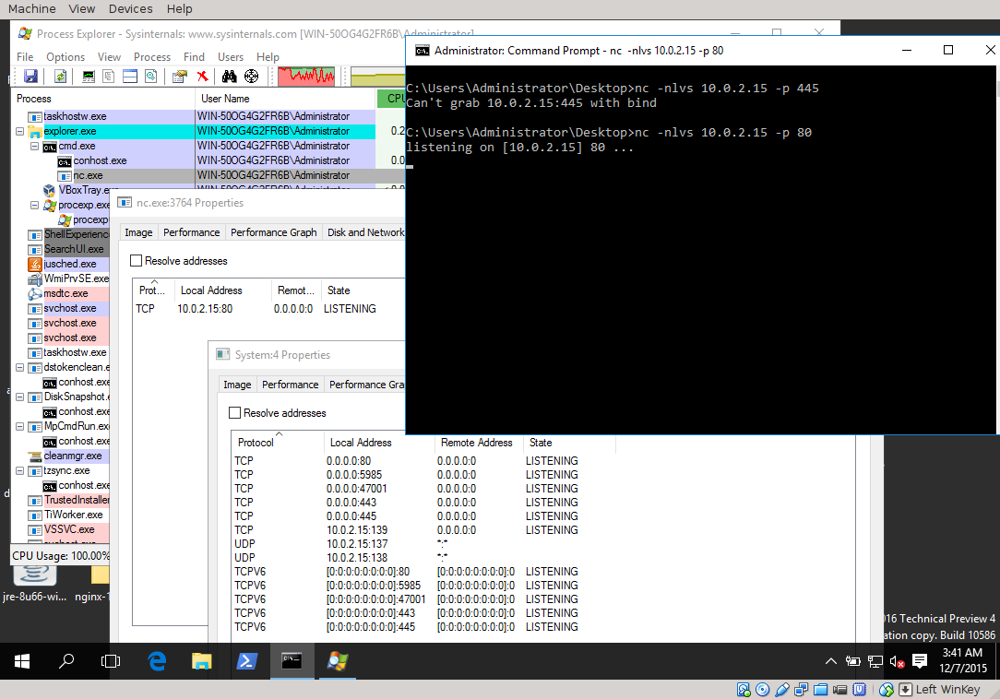

There are a few things going on here. First we see that the "System" process has a bunch of ports bound on 0.0.0.0, amongst them TCP/445 (file and printer sharing) and TCP/80 (IIS). We can see that binding another socket on port TCP/445 fails (SO_EXCLUSIVEADDRUSE is probably in use), but on port TCP/80 it succeeds, which probably means that Microsoft does not use SO_EXCLUSIVEADDRUSE in case of IIS!

But this gets more complicated: earlier I've said that the Windows socket implementation does not really care about users. It turned out that this is not the case, and something weird going on that needs further investigation: as a normal user, I was not able to hijack IIS's port TCP/80 even though I was able to hijack other sockets opened by NT AUTHORITY\SYSTEM (as I've shown with nginx). Also, hijacking Remote Desktop Protocol's TCP/3389 port is not possible with Administrator user, but it succeeds when we try it as NT AUTHORITY\SYSTEM.

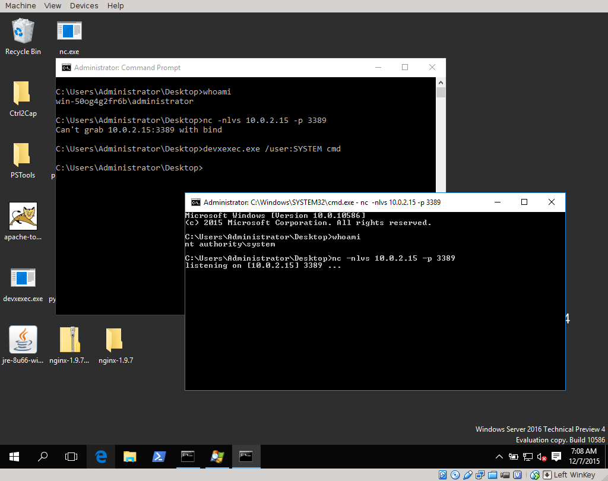

Even though one could bind TCP/3389 as NT AUTHORITY\SYSTEM, one is not able to bind a socket on e.g. TCP/445 and TCP/139 (maybe this process really uses, SO_EXCLUSIVEADDRUSE):

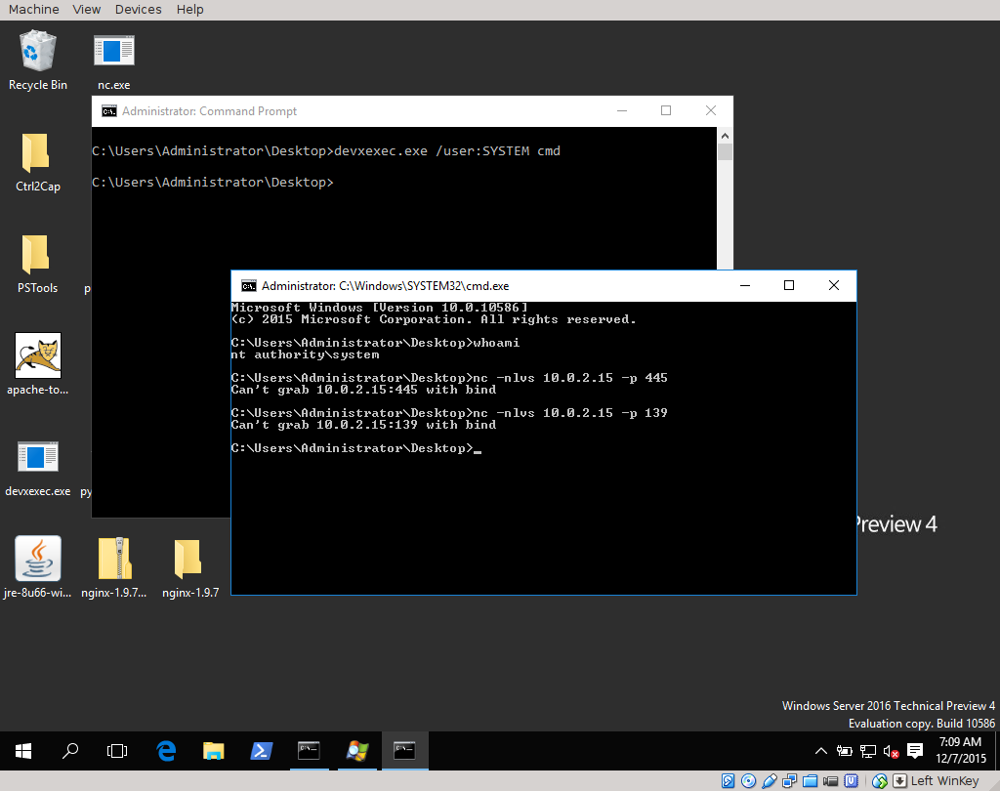

To summarize:
 
 - it is possible to hijack sockets of processes that are owned by higher privileged users than the one doing the hijacking for some applications (e.g. nginx), but not for others (e.g. IIS).
 - it is possible to hijack sockets as NT AUTHORITY\SYSTEM of some processes (e.g. RDP), but not for others (e.g. file and printer sharing)

It is clear that this needs further research on my part, right now I'm just guessing about what's really going on.

Firewall evasion
----

To provide a proof of concept, I've quickly put together a test network with a pfSense firewall, a FreeBSD running PostgreSQL, and a Windows Server 2016 running IIS. 

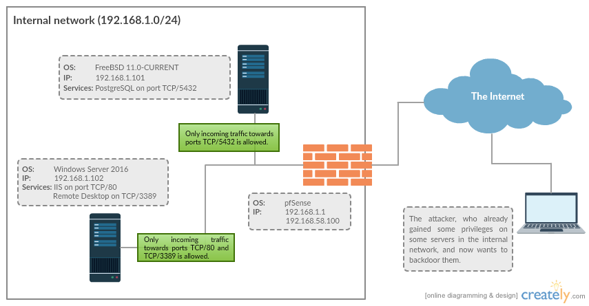

The firewall allows only incoming traffic on TCP/80 and TCP/3389 towards the Windows machine, and incoming traffic on port TCP/5432 towards the FreeBSD machine. 

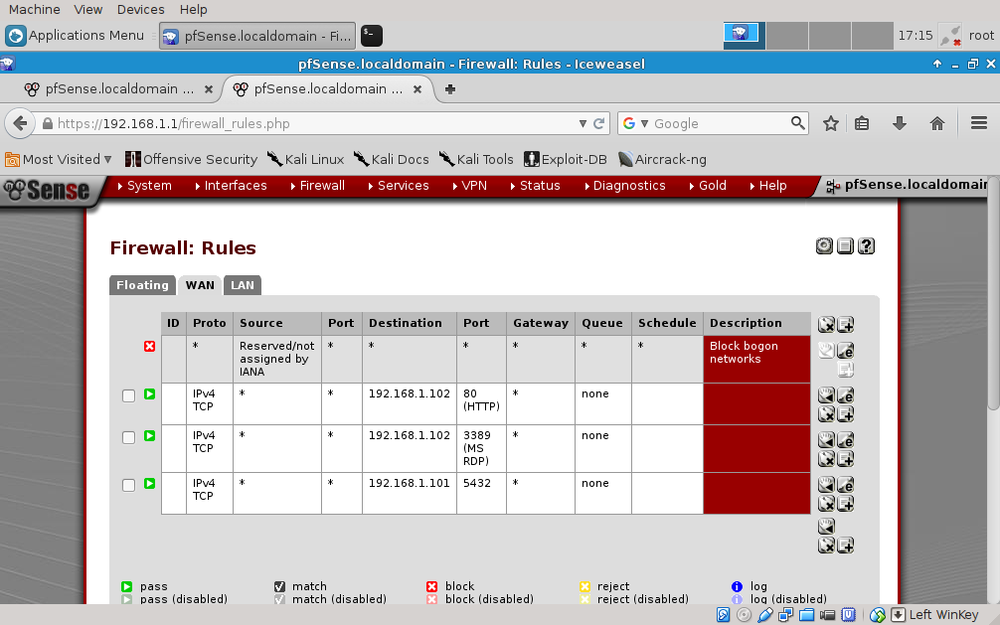

The scenario in both cases is that an attacker has already gained privileges (*Administrator* on Windows, and *pgsql* on FreeBSD) on the machines and to maintain his persistence and further attack the network, he tries to backdoor the servers. IIS, RDP and PostgreSQL listen on ports TCP/80, TCP/3389 and TCP/5432 respectively on 0.0.0.0. The attacker is able to bind sockets on these ports on specific addressess, thus hijacking the sockets. If he proxies all connections not coming from his attacker machine to the original services (e.g. to localhost:\<port\>), and handle connections coming from his machine some other way (e.g. use it as a remote shell), he is able to maintain a bind shell without disrupting the original service. This is something like Zoltan Balazs did in his DEF CON 22 talk [Bypass firewalls, application white lists, secure remote desktops in 20 seconds ](http://www.slideshare.net/cisoplatform7/defcon-22zoltanbalazsbypassfirewallsapplicationwhiteli_) but without the need to use a ring-0 component.

I've decided to prototype this using a Python proxy, and shamelessly stole and modified Ricardo Pascal's code published here: [A python proxy in less than 100 lines of code](http://voorloopnul.com/blog/a-python-proxy-in-less-than-100-lines-of-code/). The modified code can be found on my GitHub: XXX

```
[0x00 multipass]$ ./multipass.py
Listen address and port are mandatory!
./multipass.py: -l <listen address> -p <listen port> [-s <source IP> -P <source port> -L <log file>]
```

Options *-l* and *-p* are pretty obvious, they are the address and the port the proxy should listen on. To differentiate connections from legitimate sources and from the attacker, one can set an IP address and/or a port that attacker connections will be coming from using the *-s* and *-P* options. Traffic from legitimate sources will be redirected to localhost:\<port\>, and connections from the attacker will be treated as a bind shell. Traffic that goes through the proxy can also be logged to a file specified using the *-L* option.

OK, enough talking, let's see this in action! (*The following pictures are links to YouTube videos - it is not possible to embed them here.*)

FreeBSD:

[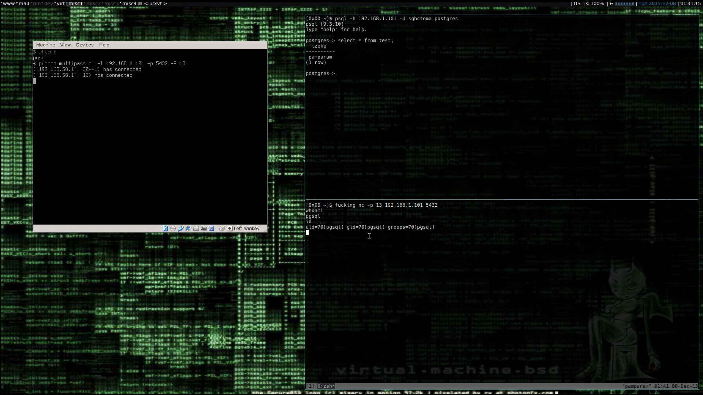](https://youtu.be/zNpn1ytp1JY)

Windows Internet Information Services:

[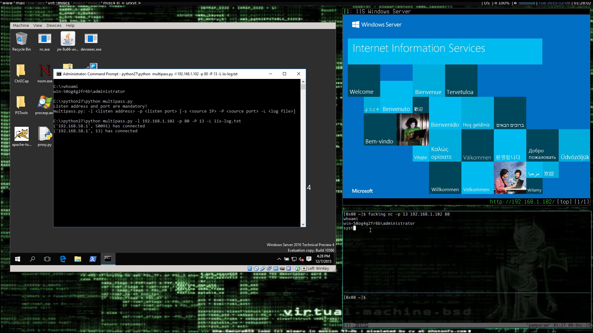](https://youtu.be/yyJ_MrB-sF4)

Windows Remote Desktop:

[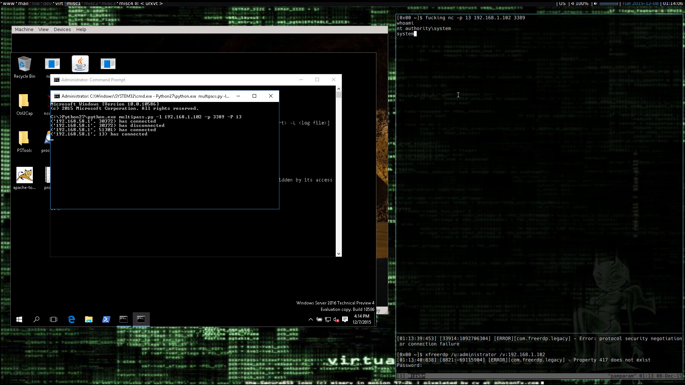](https://youtu.be/tbE_WisfmnU)

Sorry, no Linux demo yet; I have to either find some Linux services that use SO_REUSEPORT, or add UDP support to the proxy script.

Countermeasures
----

There are a few things that can be done to prevent this method:

 - Avoiding the usage of wildcard addresses, and always listening on specific IPs would render this kind of abuse impossible.
 - On Windows, developers should really use SO_EXCLUSIVEADDRUSE.
 - On FreeBSD one can hijack sockets, but only if they have appropriate permissions. So applications that bind sockets as root, and than drop privileges can only be hijacked by the root user. For example Tomcat does something like this, and I was not able to hijack the port as the "www" user.

Further research
----

This post is a result of some shallow experimenting, and there are definitely areas that need some more attention:
 
 - I'm planning to download the source of a bunch of Linux network services and collect as many of them that use SO_REUSEPORT as possible. This will give a list of services that can be abused the way described here. I don't really think there will be many such programs.
 - The same for Windows: collect services that does not use SO_EXCLUSIVEADDRUSE. There are considerably more closed source services here, so this will require some disassembling. I'm planning to do this with a tool that automatically searches for bind calls, and see if it sets this option.
 - Further investigate what's going on with various socket options on Windows with various user accounts, how, and why they behave the way they do. Right now I've just run some experiments, and I could not deduce anything solid from them - I'll have to dig deeper here too.
 - Other operating systems, mainly OpenBSD, NetBSD, OS X - although I suspect them to behave the same as FreeBSD in this regard.
 - A Meterpreter bind shell that does this whole proxying thing would be nice.
